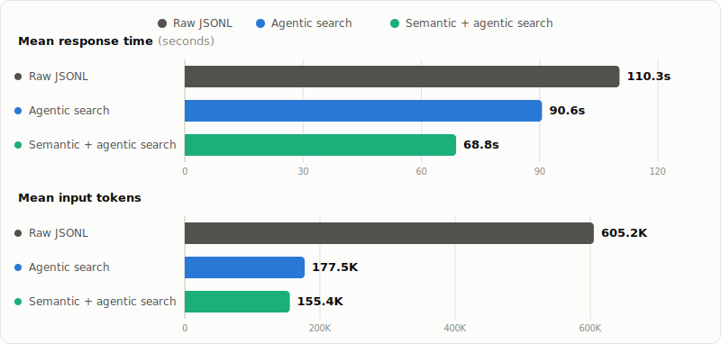

# Recall

**A searchable memory for Codex and Claude Code, built from every past session, not just what a memory extractor decided to keep.**

Recall turns your Codex and Claude Code session history into a structured, searchable memory the agent can query on its own. It works best in the common case: you roughly remember what a past session was about and can steer the agent toward it. Recall gives the agent a way to actually find that, instead of relying on a memory extractor that decided today what might matter for some unknown future session.

## Results

**3.9× fewer input tokens · 38% faster**: Recall's semantic search vs. grepping raw session logs directly, across 20 held-out questions about real past coding sessions.



**Agentic search alone** (an agent browsing Recall's generated Markdown with its own file tools, no embeddings) already cuts tokens by 3.4× and finishes 18% faster than raw JSONL. Semantic search on top of that structure pushes it further. Most of the win comes from having a structured index at all; semantic search is an additional, smaller layer on top.

*(short terminal recording coming soon)*

## Install

Download the Apple Silicon macOS release binary:

```sh
curl -L -o recall_Darwin_arm64.tar.gz \
  https://github.com/MarcBrede/recall/releases/download/v0.1.0/recall_Darwin_arm64.tar.gz
tar -xzf recall_Darwin_arm64.tar.gz
sudo mv recall /usr/local/bin/recall
sudo chmod +x /usr/local/bin/recall
```

Or build from source (requires Go 1.23+):

```sh
go install github.com/MarcBrede/recall/cmd/recall@latest
```

Recall needs two API keys: an LLM for summarization (Anthropic by default) and an embeddings provider for semantic search (OpenAI by default).

```sh
export ANTHROPIC_API_KEY=sk-ant-...
export OPENAI_API_KEY=sk-...
```

Semantic search is off by default. Turn it on in `~/.recall/config.json`:

```jsonc
{
  "search": { "enabled": true }
}
```

Ingest your recent sessions and try it:

```sh
recall ingest --last 20
recall search --type section --json --limit 3 "what did we decide about the retry backoff?"
```

Install the Recall skill so Codex or Claude Code reach for it on their own:

```sh
# Codex
mkdir -p "$HOME/.codex/skills/recall"
curl -fsSL \
  https://raw.githubusercontent.com/MarcBrede/recall/v0.1.0/skills/recall/SKILL.md \
  -o "$HOME/.codex/skills/recall/SKILL.md"

# Claude Code
mkdir -p "$HOME/.claude/skills/recall"
curl -fsSL \
  https://raw.githubusercontent.com/MarcBrede/recall/v0.1.0/skills/recall/SKILL.md \
  -o "$HOME/.claude/skills/recall/SKILL.md"
```

## The problem

An agent only knows what's in its current context window. Everything from earlier sessions is gone; even within a session, compaction quietly replaces detail with a lossy summary. The exact command that finally worked, the paper link you were reading, a trace ID, the error output that explained a bug, the shape of a project from three weeks ago: it's all still on disk, but there's no direct path from "current context" back to it.

The generic workaround is to let the agent grep the raw JSONL transcripts that Codex and Claude Code already keep under `~/.codex` and `~/.claude`. It works (the full history is genuinely there), but it's awkward: JSONL is optimized for replaying events, not answering questions, individual lines can be huge, and there's no notion of "what was this session even about" short of reconstructing it from scratch every time. That's the baseline Recall is built to beat, and the results above are measured against exactly that baseline.

## How it works

Recall ingests session transcripts and builds a layered index:

- **Session**: one original Codex or Claude Code conversation.
- **Segment**: a split of a long session around a compaction boundary.
- **Section**: one coherent user request plus the assistant/tool work that answered it.
- **Step**: a smaller unit inside a section, tied back to exact source JSONL line ranges.

Every level gets an LLM-generated summary, so the agent starts from a one-line description and only drills down when it needs to:

```text
~/.recall/
  sessions/
    2026-06-16T095338Z-codex-<session-id>/
      session.md
      segments/
        seg000/
          segment.md
          sections/
            S001.md
            S002.md
        seg001/
          ...
```

Recall also embeds every indexed node, so the agent can start from semantic search instead of using session summaries. The intended path down through all three retrieval layers looks like this:

1. **Semantic search** (`recall search`): find the relevant session, segment, or section by meaning.
2. **Agentic Markdown navigation**: read the matching file, follow links to related sections, use the frontmatter's source line ranges.
3. **Raw JSONL**: fall back to it only for exact verification (a precise URL, an ID, a timestamp, literal command output). Because the Markdown already points at the source line range, this is a narrow read, not a blind scan.

## Why keep everything instead of extracting facts?

Most agent-memory projects work the other way around: at the end of a session, decide what mattered and write it down as a durable fact or lesson. Codex's and Claude's own native memory features do this, and it's a reasonable thing to do. But it rests on knowing, at memory write time, what a *future, unknown* session will need. In practice that assumption breaks constantly: the thing worth remembering about a session is usually only obvious once a later session asks a question that needs it.

Recall's bet is the opposite: don't decide what's important at memory write time, keep everything, and spend the effort on making it *findable* instead. The natural objection is that you lose aggregated learning across sessions: no single note ever says "we've hit this class of bug three times." That's a fair critique, but in practice the aggregation still happens, just later. When an agent runs several searches to answer one question, it's the one doing the synthesizing across what those searches return, in context, for the question actually being asked, rather than trusting a summary written months earlier for a question nobody had yet.

This isn't a replacement for fact-extraction memory so much as a different layer: native memory is good at "remember this specific preference going forward"; Recall is for "what actually happened, and what can I find out about it". That's the tail of detail no memory system would have thought to extract at the time.

## Evaluation

The eval set is 20 questions built from real local Codex/Claude sessions, each requiring the agent to recover a specific fact or decision from earlier work. Each question was run under three conditions:

- **raw**: the agent answers using only `rg`/`grep`/`sed` against the original JSONL transcripts (no Recall). One run was manually stopped after exceeding a timeout.
- **indexed**: the agent has Recall's generated Markdown index available but navigates it agentically, without semantic search.
- **search**: the agent has `recall search` (embeddings-backed) available on top of the same index.

All three ran the same questions, same agent, same model, back to back.