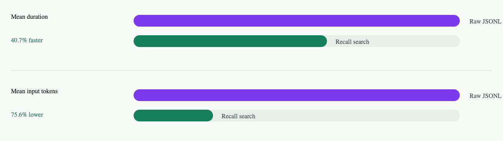

# Recall

Recall is a CLI and agent skill that turns Codex and Claude JSONL transcripts into a searchable index of Markdown summaries, with source-line links back to the raw session history. It gives agents a way to recover prior decisions, commands, links, errors, and project context after those details have fallen out of the active context window.

In a 20-question eval, Recall used about 4x fewer input tokens and finished in about 60% of the raw JSONL lookup baseline's time.

## Setup

Download the Apple Silicon macOS release binary:

```sh
curl -L -o recall_Darwin_arm64.tar.gz \
  https://github.com/MarcBrede/recall/releases/download/v0.1.0/recall_Darwin_arm64.tar.gz
```

Install it somewhere on your `PATH`:

```sh
tar -xzf recall_Darwin_arm64.tar.gz
sudo mv recall /usr/local/bin/recall
sudo chmod +x /usr/local/bin/recall
```

Run an initial ingest:

```sh
recall ingest --last 5
```

Install the Recall skill for either Codex or Claude:

```sh
# Codex
mkdir -p "$HOME/.codex/skills/recall"
curl -fsSL \
  https://raw.githubusercontent.com/MarcBrede/recall/v0.1.0/skills/recall/SKILL.md \
  -o "$HOME/.codex/skills/recall/SKILL.md"

# Claude
mkdir -p "$HOME/.claude/skills/recall"
curl -fsSL \
  https://raw.githubusercontent.com/MarcBrede/recall/v0.1.0/skills/recall/SKILL.md \
  -o "$HOME/.claude/skills/recall/SKILL.md"
```

## Why Recall Exists

### Agents Only Remember What Is in the Current Context

An agent only knows what is currently inside its context window. Information from earlier sessions is not available. Even in the same session, a compaction event can remove details from the active context and replace them with a lossy summary.

That means the agent can forget practical facts it already figured out: the exact port-forwarding command that finally worked, the link to the paper you were reading, the ID of a useful trace, the command output that explained a bug, or the high-level overview of a project you were working on. Those facts may still exist on disk, but there is no direct way for the agent to recover them from its current working context.

### The Raw JSONL Workaround

The generic workaround is to make the agent interact with the raw JSONL transcript files that contain the complete history of past sessions, stored by tools such as Codex and Claude under local dot-directories like `~/.codex` and `~/.claude`. These files are the source of truth and include the full context from each session.

This works because the agent can run shell commands against those files: search with `rg` or `grep`, inspect matching paths, and extract the relevant transcript lines.

But it is still awkward. Raw JSONL is large, individual lines can be huge, and the data is optimized for replaying events rather than answering questions. The agent can usually find the fact, but it often takes broad searches, large outputs, and extra context.

Raw logs also do not provide much high-level understanding. They do not directly answer questions like "what was this project about?", "what did we decide last session?", or "which part of the work mattered?". The agent has to reconstruct that from low-level events every time.

So raw JSONL is a useful fallback, but it is not the best primary retrieval interface.

### Recall Indexes Sessions into a Searchable Structure

Recall improves the retrieval path by turning raw session history into a structured index.

The hierarchy is:

- `Session`: one original Codex or Claude conversation.
- `Segment`: a split of a long session, generally created around compaction or size boundaries.
- `Section`: a coherent user request plus the assistant and tool work that answered it.
- `Step` or task: a smaller unit inside a section, usually tied back to source JSONL line ranges.

Each level gets an LLM-generated summary, so the agent can start from a short description and only drill down when needed. On disk, the index looks like this:

```text
~/.recall/
  sessions/
    2026-06-16T095338Z-codex-<session-id>/
      session.md
      sections/
        S001.md
        S002.md
      segments/
        seg000/
          segment.md
          sections/
            S001.md
            S002.md
```

The Markdown files contain structured summaries plus provenance back to the source transcript:

```markdown
---
source_file: "/path/to/original/session.jsonl"
start_line: 1018
end_line: 1101
summary: |
  This section analyzes answer-quality failures in the latest search eval run.
---

# S003

## Steps

- S3.T1 lines 1018-1018: User asked the assistant to analyze failure cases.
- S3.T2 lines 1019-1033: Assistant inspected run artifacts and answer schemas.
```

Recall also builds embeddings over the indexed nodes. This lets the agent start with semantic retrieval instead of guessing file paths or grepping every raw transcript. A typical workflow is:

1. Search semantically for the relevant session, segment, or section.
2. Read the matching Markdown file.
3. Follow links or source line ranges when exact facts are needed.
4. Fall back to raw JSONL only for precise verification, such as URLs, IDs, timestamps, or exact command output.

This preserves access to the full source history while giving the agent a much smaller and more useful retrieval surface.

### Recall Is Faster and More Token Efficient

The expected benefit is straightforward: the agent should find the same facts with less context and in less time. Instead of scanning raw JSONL first, it starts from semantic search and summarized Markdown, then reads raw source lines only when exact verification is required.

In a 20-question eval run, Recall showed the expected improvement:

- Mean duration was 40.7% faster than raw JSONL.
- Mean input tokens were 75.6% lower than raw JSONL.

The summary result is visualized below.


